# Database Schema - MyProPartner ERP

## Entity Relationship Diagram

```mermaid
erDiagram
    %% ============================================
    %% CORE BUSINESS ENTITIES
    %% ============================================

    Entreprise ||--o{ User : "has"
    Entreprise ||--o| Subscription : "has"
    Entreprise ||--o{ Store : "has"
    Entreprise ||--o{ Client : "has"
    Entreprise ||--o{ Article : "has"
    Entreprise ||--o{ Document : "creates"
    Entreprise ||--o{ Categorie : "has"
    Entreprise ||--o{ SerieDocument : "has"
    Entreprise ||--o{ NiveauFidelite : "defines"
    Entreprise ||--o{ Segment : "creates"
    Entreprise ||--o{ Campaign : "runs"
    Entreprise ||--o{ Automation : "configures"
    Entreprise ||--o{ PaymentLink : "generates"
    Entreprise ||--o{ Terminal : "manages"
    Entreprise ||--o| ParametresEntreprise : "has"

    %% ============================================
    %% USERS & PERMISSIONS
    %% ============================================

    User ||--o| UserPermissions : "has"
    User ||--o{ UserSchedule : "has"
    User ||--o{ TimeEntry : "tracks"
    User ||--o{ UserActivity : "logs"
    User ||--o{ Conversation : "has"
    User ||--o{ MouvementStock : "creates"

    %% ============================================
    %% STORES & INVENTORY
    %% ============================================

    Store ||--o{ Register : "has"
    Store ||--o{ StoreStockItem : "stocks"
    Store ||--o{ MouvementStock : "tracks"
    Store ||--o{ StockTransfer : "sends_from"
    Store ||--o{ StockTransfer : "receives_to"

    Register ||--o{ RegisterSession : "has"

    StockTransfer ||--o{ StockTransferItem : "contains"

    Article ||--o{ StoreStockItem : "stored_in"
    Article ||--o{ MouvementStock : "moved"
    Article ||--o{ LigneDocument : "sold_in"
    Article ||--o{ StockTransferItem : "transferred"

    Categorie ||--o{ Article : "categorizes"
    Categorie ||--o{ ChampPersonnalise : "has"

    %% ============================================
    %% CLIENTS & LOYALTY
    %% ============================================

    Client ||--o{ Document : "receives"
    Client ||--o{ ClientNotification : "receives"
    Client ||--o{ MouvementPoints : "earns"
    Client }o--|| NiveauFidelite : "belongs_to"
    Client ||--o{ PasswordResetToken : "requests"
    Client ||--o{ InvitationToken : "receives"

    %% ============================================
    %% DOCUMENTS & INVOICING
    %% ============================================

    Document ||--o{ LigneDocument : "contains"
    Document ||--o{ Paiement : "paid_by"
    Document }o--|| SerieDocument : "belongs_to"

    %% ============================================
    %% MARKETING & AUTOMATION
    %% ============================================

    Segment ||--o{ Campaign : "targets"

    Automation ||--o{ AutomationExecution : "executes"

    %% ============================================
    %% CONVERSATIONS & AI
    %% ============================================

    Conversation ||--o{ Message : "contains"

    %% ============================================
    %% PAYMENTS & BILLING
    %% ============================================

    BankTransaction }o--o| Document : "reconciles"

    %% ============================================
    %% TABLES DEFINITIONS
    %% ============================================

    Entreprise {
        string id PK
        string nom
        string email UK
        string slug UK
        string siret UK
        string plan
        boolean abonnementActif
        string businessType
        datetime createdAt
        datetime updatedAt
    }

    Subscription {
        string id PK
        string entrepriseId FK
        string plan
        string status
        string stripeCustomerId
        string stripeSubscriptionId
        datetime currentPeriodEnd
        boolean cancelAtPeriodEnd
        datetime createdAt
        datetime updatedAt
    }

    User {
        string id PK
        string entrepriseId FK
        string email UK
        string nom
        string prenom
        string role
        string status
        boolean isOwner
        datetime createdAt
        datetime updatedAt
    }

    Store {
        string id PK
        string entrepriseId FK
        string nom
        string adresse
        string telephone
        string status
        boolean isMainStore
        datetime createdAt
        datetime updatedAt
    }

    Client {
        string id PK
        string entrepriseId FK
        string nom
        string prenom
        string email
        string telephone
        string adresse
        string niveauFideliteId FK
        int points_solde
        boolean clientPortalEnabled
        boolean pendingApproval
        datetime createdAt
        datetime updatedAt
    }

    Article {
        string id PK
        string entrepriseId FK
        string categorieId FK
        string reference UK
        string nom
        string type
        decimal prix_achat
        decimal prix_vente_ht
        decimal tva
        int stock_actuel
        int stock_alerte
        boolean actif
        datetime createdAt
        datetime updatedAt
    }

    Categorie {
        string id PK
        string entrepriseId FK
        string nom
        int ordre
    }

    Document {
        string id PK
        string entrepriseId FK
        string clientId FK
        string serieId FK
        string numero UK
        string type
        string statut
        date dateEmission
        date dateEcheance
        decimal montant_ht
        decimal montant_tva
        decimal montant_ttc
        datetime createdAt
        datetime updatedAt
    }

    LigneDocument {
        string id PK
        string documentId FK
        string articleId FK
        string designation
        int quantite
        decimal prix_unitaire_ht
        decimal tva
        decimal montant_ht
        decimal montant_tva
        decimal montant_ttc
        int ordre
        datetime createdAt
    }

    Paiement {
        string id PK
        string documentId FK
        date date_paiement
        decimal montant
        string moyen_paiement
        string reference
        datetime createdAt
    }

    MouvementStock {
        string id PK
        string entrepriseId FK
        string articleId FK
        string storeId FK
        string createdBy FK
        string type
        int quantite
        int stock_avant
        int stock_apres
        datetime createdAt
    }

    StoreStockItem {
        string id PK
        string storeId FK
        string articleId FK
        int quantite
        int quantite_reservee
        int seuilAlerte
        datetime lastUpdated
    }

    NiveauFidelite {
        string id PK
        string entrepriseId FK
        string nom
        int seuilPoints
        decimal remise
        int ordre
        boolean actif
        datetime createdAt
        datetime updatedAt
    }

    MouvementPoints {
        string id PK
        string entrepriseId FK
        string clientId FK
        string type
        int points
        string raison
        datetime createdAt
        datetime dateExpiration
    }

    Segment {
        string id PK
        string entrepriseId FK
        string nom
        string type
        json conditions
        boolean actif
        datetime createdAt
        datetime updatedAt
    }

    Campaign {
        string id PK
        string entrepriseId FK
        string segmentId FK
        string nom
        string type
        string statut
        json contenu
        datetime scheduledAt
        datetime sentAt
        datetime createdAt
        datetime updatedAt
    }

    Automation {
        string id PK
        string entrepriseId FK
        string nom
        string triggerType
        json conditions
        json actions
        boolean actif
        datetime createdAt
        datetime updatedAt
    }

    Conversation {
        string id PK
        string userId FK
        string entrepriseId FK
        string titre
        boolean pinned
        datetime createdAt
        datetime updatedAt
    }

    Message {
        string id PK
        string conversationId FK
        string role
        text contenu
        datetime createdAt
    }

    SerieDocument {
        string id PK
        string entrepriseId FK
        string nom
        string prefixe
        int prochain_numero
        boolean est_defaut_devis
        boolean est_defaut_factures
        boolean est_defaut_avoirs
        boolean active
        datetime createdAt
        datetime updatedAt
    }

    Terminal {
        string id PK
        string entrepriseId FK
        string nom
        string status
        string stripeTerminalId
        datetime createdAt
        datetime updatedAt
    }

    PaymentLink {
        string id PK
        string entrepriseId FK
        string titre
        string slug UK
        decimal montant
        boolean actif
        datetime dateExpiration
        datetime createdAt
        datetime updatedAt
    }

    BankTransaction {
        string id PK
        string entrepriseId FK
        string documentId FK
        date date
        decimal montant
        string statut
        string libelle
        datetime createdAt
        datetime updatedAt
    }
```

## Table Groups

### 🏢 Core Business
- **Entreprise**: Main tenant entity (multi-tenant architecture)
- **Subscription**: Billing and plan management
- **UsageCounter**: Monthly usage tracking for limits
- **ParametresEntreprise**: Company-specific settings

### 👥 Users & Teams
- **User**: Application users with roles
- **UserPermissions**: Granular permissions per user
- **UserSchedule**: Work schedules
- **TimeEntry**: Time tracking
- **UserActivity**: Audit log of user actions
- **UserInvitationToken**: Team member invitations

### 🏪 Stores & Multi-location
- **Store**: Physical/virtual store locations
- **Register**: POS terminals
- **RegisterSession**: POS shift sessions
- **StoreStockItem**: Stock per store
- **StockTransfer**: Inter-store transfers
- **StockTransferItem**: Transfer line items

### 🛍️ Products & Inventory
- **Article**: Products and services
- **Categorie**: Product categories
- **ChampPersonnalise**: Custom fields for categories
- **MouvementStock**: Stock movements (in/out)

### 👤 Clients & Loyalty
- **Client**: Customer database
- **NiveauFidelite**: Loyalty tiers
- **MouvementPoints**: Points transactions
- **ClientNotification**: Client notifications
- **PasswordResetToken**: Password reset for client portal
- **InvitationToken**: Client portal invitations

### 📄 Documents & Invoicing
- **Document**: Quotes, invoices, credit notes
- **LigneDocument**: Document line items
- **Paiement**: Payment records
- **SerieDocument**: Document numbering series

### 📊 Marketing & Automation
- **Segment**: Customer segments
- **Campaign**: Marketing campaigns
- **Automation**: Workflow automations
- **AutomationExecution**: Automation run logs

### 💬 AI Assistant
- **Conversation**: User conversation threads
- **Message**: Individual messages with AI

### 💳 Payments & Banking
- **PaymentLink**: Payment link generator
- **Terminal**: Stripe Terminal integration
- **BankTransaction**: Bank reconciliation

## Key Features

### Multi-tenant Architecture
- `entrepriseId` field on all tenant-scoped tables
- Row-level data isolation
- Indexes on `entrepriseId` for performance

### Scalability Optimizations
- **Composite indexes** on frequently queried field combinations
- **Simple indexes** on foreign keys and filter fields
- Ready for 100k+ documents, 500k+ line items

### Audit Trail
- `createdAt` and `updatedAt` on most tables
- UserActivity log for sensitive actions
- Soft deletes where needed

### Plan-based Limitations
- Enforced at API level using `lib/pricing-config.ts`
- UsageCounter for monthly limits (documents, questions)
- Feature flags per plan (analytics, segments, etc.)

## Database Statistics

- **Total Tables**: 39
- **Tables with Indexes**: 39/39 ✅
- **Critical Tables for Scale**: Document, LigneDocument, Article, Client, MouvementStock, Paiement
- **Optimization Grade**: C (good, room for improvement)

## Naming Conventions

- **PascalCase** for model names: `Document`, `LigneDocument`
- **camelCase** for field names: `entrepriseId`, `dateEmission`
- **snake_case** for legacy fields: `date_paiement`, `prix_vente_ht`
- **Enum values**: UPPERCASE (`BROUILLON`, `VALIDE`, `ENVOYE`)

## Relationships Summary

### One-to-Many (Most Common)
- Entreprise → Users, Clients, Documents, Articles
- Document → LigneDocument, Paiement
- Client → Documents, MouvementPoints

### One-to-One
- Entreprise ↔ Subscription
- Entreprise ↔ ParametresEntreprise
- User ↔ UserPermissions

### Many-to-Many (via junction tables)
- Articles ↔ Stores (via StoreStockItem)
- Segments ↔ Campaigns (direct FK)
